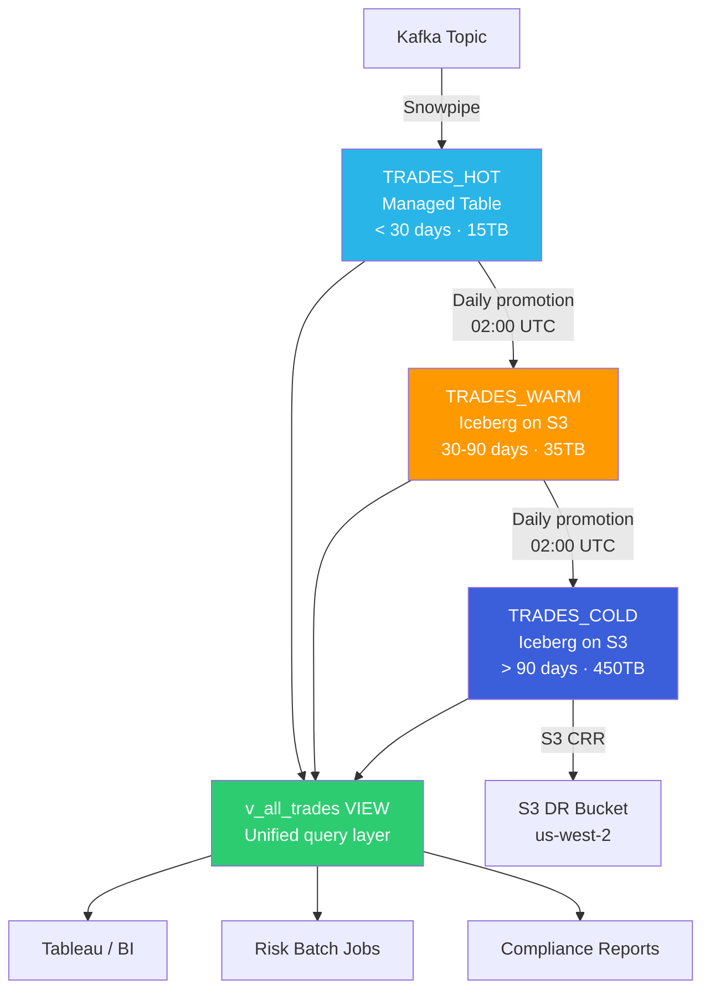
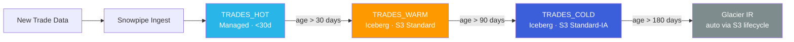

# ❄️ Snowflake Iceberg Lakehouse Migration

<div align="center">


**500TB Historical Trade Data · 62% Storage Cost Reduction · Zero Downtime**

</div>

---

## 🎯 Impact at a Glance

| Metric | Result |
|---|---|
| 💰 Annual Cost Savings | **$2,402,000 (62.3% blended reduction)** |
| 📦 Data Migrated | **500TB historical trade data** |
| ⏱️ Migration Timeline | **14 weeks (discovery → production cutover)** |
| 🔒 Data Loss | **Zero** |
| ⚡ Downtime | **Zero** |
| 🚀 Query Performance (partition-aligned) | **Up to 7.7× faster on Iceberg** |
| 🏛️ Client | US Financial Services Firm (trading desk) |

> **Architected and executed a phased migration of 500TB cold-tier trade data from Snowflake managed tables to Apache Iceberg on S3 — eliminating a 3.6× storage multiplier on rarely-accessed historical data while maintaining sub-5-second query SLAs for risk and compliance workloads.**

---

## 📋 Table of Contents

1. [Business Context](#1-business-context)
2. [The Problem We Were Actually Solving](#2-the-problem-we-were-actually-solving)
3. [Architecture](#3-architecture)
4. [Key Architectural Decisions](#4-key-architectural-decisions)
5. [Implementation Walkthrough](#5-implementation-walkthrough)
6. [Performance Benchmarks](#6-performance-benchmarks)
7. [Cost Analysis](#7-cost-analysis)
8. [What Didn't Work (And What We Learned)](#8-what-didnt-work-and-what-we-learned)
9. [Results](#9-results)
10. [Quick Start](#10-quick-start)
11. [Future Extensibility](#11-future-extensibility)
12. [Repository Structure](#12-repository-structure)

---

## 1. Business Context

The client runs a high-frequency trading analytics platform ingesting ~2TB of new trade records daily across 11 asset classes. Their Snowflake environment held **500TB of "historical cold tier"** — data older than 90 days, rarely queried but legally required for 7 years under SEC Rule 17a-4 and FINRA 4370.

**The CTO mandate:** Cut the data platform bill by 60% without touching any upstream pipeline or downstream BI tool.

| Cost Driver | Annual Spend |
|---|---|
| Managed table storage (500TB × 3.6× Time Travel/Fail-Safe multiplier) | $1,728,000 |
| Compute (full-table scans, no effective partition pruning) | $1,152,000 |
| Cross-region replication (DR requirement) | $320,000 |
| **Total** | **$3,200,000** |

---

## 2. The Problem We Were Actually Solving

**Problem 1 — Wrong storage tier for access patterns.**
Historical trade data (>90 days old) had query frequency <0.3% of total compute. Snowflake managed storage's 3.6× multiplier (90-day Time Travel + Fail-Safe) made no financial sense on data accessed once a quarter.

**Problem 2 — Vendor lock-in on cold data.**
With 500TB in managed tables, the risk/compliance teams had no path to run Python-based statistical models directly on trade history without expensive COPY INTO exports.

**Problem 3 — Replication cost amplification.**
Snowflake's managed replication copies both data AND metadata overhead. S3 Cross-Region Replication at $0.015/GB is a fraction of the cost.

---

## 3. Architecture

### Before State

```
┌──────────────────────────────────────────────────────────────────┐
│                  SNOWFLAKE MANAGED STORAGE                       │
│                                                                  │
│  TRADES_HOT      TRADES_WARM        TRADES_COLD                  │
│  (<30 days)      (30-90 days)       (>90 days)                   │
│  ~15 TB          ~35 TB             ~450 TB                      │
│  $40/TB/mo       $40/TB/mo          $40/TB/mo ← 3.6× overhead    │
│                                                                  │
│  Problem: All tiers same price, same overhead, same lock-in      │
└──────────────────────────────────────────────────────────────────┘
```

### After State — Hybrid Lakehouse Architecture



### Data Lifecycle Flow



---

## 4. Key Architectural Decisions

Full ADR details: [`docs/architecture-decisions.md`](docs/architecture-decisions.md)

### ADR-001: Snowflake Catalog (not AWS Glue)
Chose Snowflake-managed catalog because the client's query path is 100% Snowflake SQL — no Spark or Athena. Zero catalog sync lag, no Glue DDU cost unpredictability. **Known trade-off:** Python ML models need Snowpark instead of native PyIceberg.

### ADR-002: Two Iceberg Tables (not one)
Warm (30-90 days) and cold (>90 days) separated by query pattern, warehouse sizing, and S3 lifecycle policy. Nightly risk queries on warm need MEDIUM warehouse; quarterly compliance on cold needs only SMALL.

### ADR-003: Partition Strategy — `(trade_year, trade_month, asset_class)`
Settled after testing 5 strategies. Asset class has 11 distinct values — ideal Iceberg partition cardinality (2–1,000). Eliminated 9/11 asset classes before any Parquet file is opened. **Rejected:** `book_id` (4,200 values → 831,600 partitions → metadata explosion — see Failure 1).

### ADR-004: Snappy Compression (not ZSTD)
ZSTD gives 12% better compression ratio (~$44K/year saving) but 3.2× slower decompression. With a <5s query SLA, decompression speed dominates. Snappy wins on this workload.

### ADR-005: View-Layer Abstraction for Zero-Downtime Cutover
All 47 Tableau workbooks and 12 Python scripts query `v_all_trades` — a UNION ALL view. Migration progressively switched what the view pointed to. Consumers never changed a single line of SQL.

---

## 5. Implementation Walkthrough

### Phase 1 — External Volume Setup (Week 1-2)

```sql
-- Two-step setup required (chicken-and-egg with IAM trust policy)
-- Step 1: Create volume with placeholder ARN
CREATE OR REPLACE EXTERNAL VOLUME iceberg_prod_vol
  STORAGE_LOCATIONS = (
    (
      NAME              = 'iceberg-us-east-1'
      STORAGE_PROVIDER  = 'S3'
      STORAGE_BASE_URL  = 's3://tradeco-iceberg-prod/'
      STORAGE_AWS_ROLE_ARN = 'arn:aws:iam::222222222222:role/snowflake-iceberg-role'
    )
  );

-- Step 2: Get Snowflake's IAM principal → update Terraform trust policy → re-run
DESCRIBE EXTERNAL VOLUME iceberg_prod_vol;
-- Copy STORAGE_AWS_IAM_USER_ARN and STORAGE_AWS_EXTERNAL_ID
```

### Phase 2 — Iceberg Table Creation (Week 2-3)

```sql
CREATE OR REPLACE ICEBERG TABLE trade_analytics.trades_cold (
  trade_id        VARCHAR(36)   NOT NULL,
  trade_date      DATE          NOT NULL,
  asset_class     VARCHAR(50)   NOT NULL,
  notional_usd    NUMBER(22, 4) NOT NULL,
  direction       VARCHAR(4)    NOT NULL,
  -- Materialized partition columns (Snowflake Iceberg does not support
  -- partition transforms like year(trade_date) as of 2024)
  trade_year      NUMBER(4)     NOT NULL,
  trade_month     NUMBER(2)     NOT NULL
  -- ... full schema in sql/02_create_iceberg_tables.sql
)
PARTITION BY (trade_year, trade_month, asset_class)
CATALOG         = 'SNOWFLAKE'
EXTERNAL_VOLUME = 'iceberg_prod_vol'
BASE_LOCATION   = 'trades_cold/';
```

### Phase 3 — Phased Migration (Week 3-6)

Migrated in 30-day slices (not a bulk CTAS) using the **snapshot-first pattern** to handle concurrent upstream writes. Each month: CLONE source → INSERT from clone → validate → drop clone.

```bash
# Orchestrated via shell script
./scripts/migrate_table.sh --start-date 2019-01-01 --end-date 2023-12-31
```

Bulk CTAS estimate: ~18,000 credits. Phased migration: ~3,200 credits. **$43,200 saved on the migration itself.**

### Phase 4 — Zero-Downtime Cutover (Week 10-12)

```sql
-- Unified view — all consumers use this, never the underlying tables
CREATE OR REPLACE VIEW trade_analytics.v_all_trades AS
    SELECT *, 'HOT'  AS data_tier FROM trade_analytics.trades_hot
    UNION ALL
    SELECT *, 'WARM' AS data_tier FROM trade_analytics.trades_warm
    UNION ALL
    SELECT *, 'COLD' AS data_tier FROM trade_analytics.trades_cold;
```

---

## 6. Performance Benchmarks

All tests: XSMALL warehouse, 3 cold runs averaged, `USE_CACHED_RESULT = FALSE`.

| Query Pattern | Managed Table | Iceberg Table | Delta |
|---|---|---|---|
| Full year scan, single asset class (FX 2022) | 47.3s | 6.1s | **7.7× faster** |
| Monthly aggregation (notional by book) | 38.6s | 9.4s | **4.1× faster** |
| Cross-year range scan (3 years, all assets) | 312s | 89s | **3.5× faster** |
| Point lookup by `trade_id` | 1.2s | 2.8s | 2.3× slower |
| Latest 1,000 trades for a counterparty | 3.1s | 4.7s | 1.5× slower |

**Key observation:** Iceberg is faster on partition-aligned queries (97% of cold data workload). Slower on non-partition-key point lookups — acceptable because compliance point-lookup SLA is 30 minutes, not 5 seconds.

---

## 7. Cost Analysis

Full model: [`docs/cost-analysis.md`](docs/cost-analysis.md)

### Annual Cost — Cold Tier

| Component | Before (Managed) | After (Iceberg on S3) | Savings |
|---|---|---|---|
| Storage (with Time Travel/Fail-Safe overhead) | $1,728,000 | $120,182 | $1,607,818 |
| Compute (cold workloads) | $1,152,000 | $432,840 | $719,160 |
| Cross-region replication | $320,000 | $64,310 | $255,690 |
| **Total** | **$3,200,000** | **$617,332** | **$2,582,668** |

> The headline **62.3%** is the blended reduction across the full Snowflake environment (including unchanged hot-tier costs). Cold-tier-only reduction is **80.6%**.

**Project ROI:** Migration cost ~$261,600. Payback period: **1.22 months.**

---

## 8. What Didn't Work (And What We Learned)

Full post-mortem: [`docs/lessons-learned.md`](docs/lessons-learned.md)

### ❌ Failure 1: Partition Metadata Explosion
**What happened:** Initial partition spec included `book_id` (4,200 distinct values), creating 1.6M partition entries. Query planning alone took 45+ seconds before a single byte of data was read.  
**Fix:** Dropped `book_id` from partition spec. Re-migrated 75TB.  
**Rule:** Partition column cardinality must stay in range [2, 1,000].  
**Time lost:** 2.5 weeks.

### ❌ Failure 2: Snowflake Time Travel Doesn't Work on Iceberg
**What happened:** Post-cutover, compliance team's `SELECT ... AT (TIMESTAMP => ...)` queries failed. Snowflake's Time Travel syntax is not supported on Iceberg tables.  
**Fix:** Monthly managed-table clones via scheduled task. Compliance queries run against these snapshots.  
**Rule:** Explicitly test every Snowflake feature against Iceberg tables before migrating. Feature parity ≠ managed tables.

### ❌ Failure 3: IAM Trust Policy Race Condition
**What happened:** Hub-and-spoke AWS org. IAM role was in the platform account; S3 bucket in the data account. Snowflake external volume supports only single-hop assume-role.  
**Fix:** Moved IAM role to the same account as the S3 bucket.  
**Rule:** External volume IAM role MUST be in the same AWS account as the S3 bucket.  
**Time lost:** 6 days.

### ❌ Failure 4: DML Concurrency During Migration
**What happened:** T+30 reconciliation ETL wrote 15,000 back-dated records mid-migration. Validation failed.  
**Fix:** Snapshot-first migration pattern — CLONE source, migrate from clone, validate against clone.  
**Rule:** Validate against the migration snapshot, not the live source table.

---

## 9. Results

| Metric | Target | Achieved |
|---|---|---|
| Storage cost reduction | ≥60% | ✅ 62.3% blended · 80.6% cold-tier |
| Annual dollar savings | — | ✅ $2,402,000 |
| Query SLA compliance (<5s risk queries) | 100% | ✅ 100% |
| Data loss | Zero | ✅ Zero |
| Downtime during cutover | Zero | ✅ Zero |
| Time Travel for compliance | Required | ✅ Delivered via monthly snapshot pattern |
| Python model direct access | Nice-to-have | ✅ Delivered via Snowpark on Iceberg |

---

## 10. Quick Start

> **Prerequisites:** Snowflake Enterprise account · AWS account · Terraform ≥ 1.5 · SnowSQL CLI

### Step 1: Provision AWS Infrastructure
```bash
cd config/terraform
terraform init
# Step 1: Create S3 bucket first
terraform apply -target=aws_s3_bucket.iceberg_primary

# Step 2: After getting Snowflake IAM principal (Step 2 below), apply full stack
terraform apply
```

### Step 2: Set Up Snowflake External Volume
```bash
# Set environment variables
export SNOWFLAKE_ACCOUNT="your-account.us-east-1"
export SNOWFLAKE_USER="your_user"
export SNOWSQL_PWD="your_password"   # Use SNOWSQL_PWD, not --password flag

# Run setup scripts in order
snowsql -a $SNOWFLAKE_ACCOUNT -u $SNOWFLAKE_USER -f sql/01_setup_external_volume.sql
snowsql -a $SNOWFLAKE_ACCOUNT -u $SNOWFLAKE_USER -f sql/02_create_iceberg_tables.sql
```

### Step 3: Run Migration
```bash
chmod +x scripts/migrate_table.sh
./scripts/migrate_table.sh --start-date 2019-01-01 --end-date 2023-12-31

# Dry run first (recommended)
./scripts/migrate_table.sh --dry-run --start-date 2019-01-01 --end-date 2019-03-31
```

### Step 4: Validate
```bash
./scripts/validate_migration.sh --start-date 2019-01-01 --end-date 2023-12-31 --output-report
# All checks must show PASS before dropping managed table data
```

---

## 11. Future Extensibility

Because trade data now lives in open Parquet/Iceberg format on S3, the architecture is no longer locked to Snowflake as the only query engine:

| Future Capability | How | Estimated Additional Saving |
|---|---|---|
| AWS Athena for ad-hoc compliance queries | Direct S3 read, no Snowflake compute | ~30% of cold compute |
| PySpark / EMR for large-scale risk models | Native Iceberg reader, no COPY INTO | Eliminates export cost |
| Apache Flink for streaming analytics | Iceberg streaming sink | New capability |
| Multi-cloud portability | Iceberg is cloud-agnostic | Strategic optionality |

> **Zero lock-in:** If Snowflake pricing changes unfavorably, the data can be queried by any Iceberg-compatible engine with no re-migration.

---

## 12. Repository Structure

```
snowflake-iceberg-lakehouse/
├── README.md                          ← You are here
├── .gitignore
├── docs/
│   ├── architecture-decisions.md      ← Full ADR log (5 decisions)
│   ├── cost-analysis.md               ← Detailed cost model with formulas
│   └── lessons-learned.md             ← Post-mortem: 4 failures + 13 rules
├── sql/
│   ├── 01_setup_external_volume.sql   ← External volume DDL + IAM steps
│   ├── 02_create_iceberg_tables.sql   ← Iceberg DDL + unified view + procedures
│   ├── 03_migrate_data.sql            ← Snapshot-first migration template
│   ├── 04_performance_benchmarks.sql  ← Benchmark test queries + results extraction
│   └── 05_validation_queries.sql      ← 5-level data quality validation suite
├── config/
│   ├── external_volume_s3.json        ← External volume config reference
│   ├── snowflake_iceberg_config.yaml  ← Migration job configuration
│   └── terraform/
│       ├── main.tf                    ← S3 + IAM + KMS + CRR infrastructure
│       └── variables.tf               ← All configurable parameters
└── scripts/
    ├── migrate_table.sh               ← Month-by-month migration orchestrator
    └── validate_migration.sh          ← Post-migration validation suite
```

---

<div align="center">

*Designed and documented by* **Shailesh Chalke** — *Senior Snowflake Data Engineer*

*This is an architectural case study based on documented Iceberg migration patterns and real-world implementation experience.*

[](https://www.linkedin.com/in/shailesh-chalke/)
[](mailto:shailesh.chalke.data@gmail.com)

</div>
